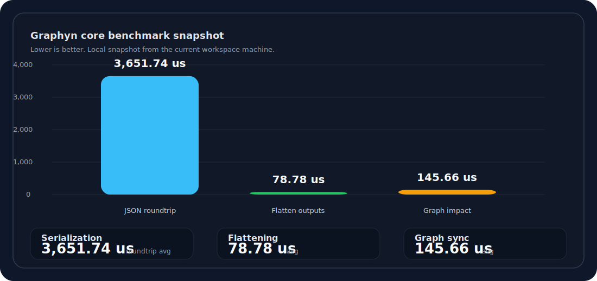

# Graphyn

[](https://kotlinlang.org/)
[](https://www.jetbrains.com/lp/compose-multiplatform/)
[](https://kotlinlang.org/docs/multiplatform.html)

Graphyn is a Kotlin Multiplatform workflow editor library with:

- a shared `core` model for workflow types, nodes, validation, and serialization
- an editor shell for canvas, panels, and node-specific UI
- a server runtime for execution only

Use Graphyn as the editing layer inside another repo when you want:

- an AI generation workflow builder
- a 3D game editor pipeline
- a shader or material graph editor
- any other app that needs a reusable node-based workflow surface

## Plugin Model

Graphyn splits plugins into two layers:

- runtime plugins register node specs and executors
- editor plugins register custom inspector panels

The built-in demo wires both through shared bootstrap helpers, but external hosts can provide their own plugin lists too.

## Quick Start

Minimal branding and shell customization:

```kotlin
App(
    branding = GraphynBranding(
        appName = "My Studio",
        palette = GraphynPalette(
            primary = Color(0xFF6D5EF6),
            background = Color(0xFFF6F7FB),
        ),
    ),
)
```

Runtime plugin registration:

```kotlin
val runtimeRegistry = DefaultGraphynPluginRegistry().apply {
    install(MyWorkflowPlugin)
}

val nodeSpecs = runtimeRegistry.nodeSpecs
val nodeExecutors = runtimeRegistry.nodeExecutors
```

Editor plugin registration:

```kotlin
val editorRegistry = DefaultGraphynEditorPluginRegistry().apply {
    install(MyInspectorPlugin)
}

val panels = editorRegistry.panels
```

Host wiring:

```kotlin
App(
    plugins = listOf(MyWorkflowPlugin),
    panels = editorRegistry.panels,
)
```

If you want the bundled demo setup, `DemoApp()` uses the sample runtime and editor plugins from shared bootstrap code. If you want your own host setup, call `App(...)` directly and pass your own plugin lists.

## Layout

- [`/core`](./core/src) - workflow model, validation, plugin contracts, JSON serialization
- [`/app/shared`](./app/shared/src) - shared editor shell and panel host
- [`/app/androidApp`](./app/androidApp) - Android entrypoint
- [`/app/desktopApp`](./app/desktopApp) - Desktop entrypoint
- [`/app/webApp`](./app/webApp) - Web entrypoint
- [`/app/iosApp`](./app/iosApp) - iOS entrypoint
- [`/server`](./server/src/main/kotlin) - execution runtime
- [`/docs`](./docs) - architecture notes, agent rules, and plans

## Running

- Android: `./gradlew :app:androidApp:assembleDebug`
- Desktop: `./gradlew :app:desktopApp:run`
- Web Wasm: `./gradlew :app:webApp:wasmJsBrowserDevelopmentRun`
- Web JS: `./gradlew :app:webApp:jsBrowserDevelopmentRun`
- Server: `./gradlew :server:run`

## Testing

- Shared tests: `./gradlew :app:shared:check`
- Core tests: `./gradlew :core:check`
- Server tests: `./gradlew :server:test`

## Docs

- [Agent rules](./docs/agents.md)
- [Architecture overview](./docs/architecture/README.md)
- [Core API draft](./docs/architecture/core-api.md)
- [Plugin API draft](./docs/architecture/plugins.md)
- [Plan phases](./docs/plans/README.md)

## Performance

Snapshot benchmark from the current workspace machine:



- [Benchmark notes](./docs/benchmarks/README.md)
- Run it with `./gradlew :core:benchmarkCore`
