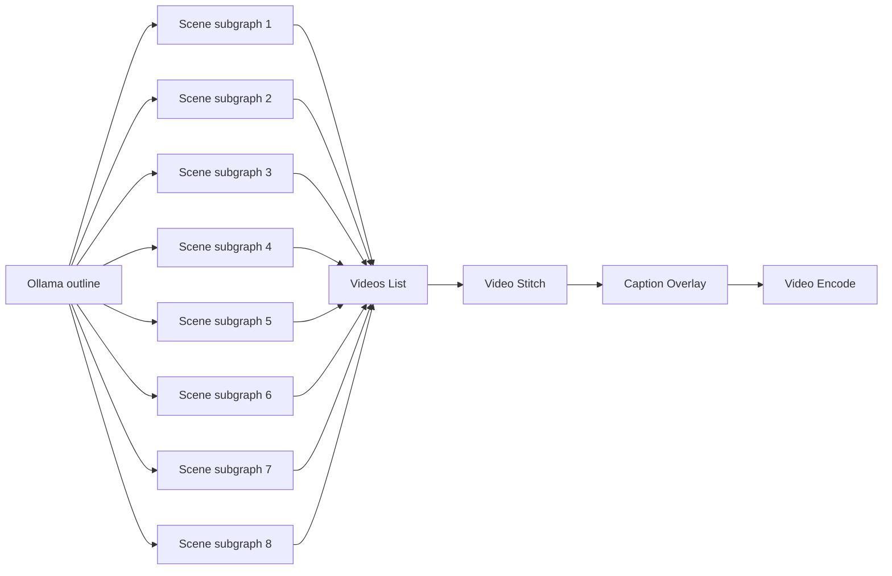

# Shorts Workflow Draft

This draft uses a subgraph boundary for each scene so the canvas stays readable while the
top-level flow handles outline, stitching, captions, and export.

## Structure

## Scene Subgraph

Each scene subgraph should own the motion for one 4-second beat:

1. `sd.txt2img` or `sd.img2img` generates the scene keyframe.
2. `sd.img2vid` animates the frame with a camera move.
3. The scene returns one finished video clip to the parent workflow.

## Parent Workflow

1. Ask Ollama for an 8-beat outline and a caption script.
2. Feed each beat into a scene subgraph.
3. Collect the 8 scene clips with `media.videos_list`.
4. Stitch them with `media.video_stitch`.
5. Burn captions with `media.caption_overlay`.
6. Encode the final short with `media.video_encode`.

## What Exists Today

- Ollama generation already exists through `WorkflowGenerator`.
- FLUX and Qwen image generation already exist as stable-diffusion nodes.
- Wan image-to-video already exists as a stable-diffusion node.
- `media.video_stitch`, `media.caption_overlay`, and `media.video_encode` already exist.
- Subgraphs already run in the engine and in the editor.

## Missing Bridge

Wan currently emits frame paths, while `media.video_stitch` wants video handles.
So the draft needs one of these before it becomes fully executable:

- a frame-to-video adapter node, or
- a scene renderer that wraps the Wan frames into a video handle.

Until that bridge exists, the subgraph draft is the right design boundary, but the scene output
should be treated as a planned video clip rather than a completed stitched asset.
