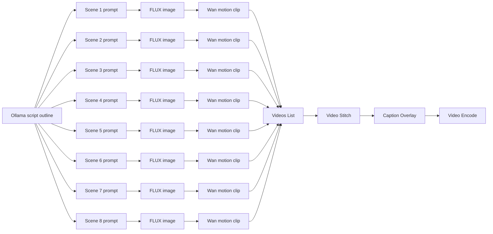

# Video Shorts Storyboard

This storyboard turns temporary generated keyframes into a 32-second vertical short:
8 scenes, 4 seconds each, stitched into one clip and finished with captions.

## Pipeline

1. Ask the Ollama host for an 8-beat script outline and caption script.
2. Generate one keyframe per scene with FLUX image generation.
3. Turn each keyframe into a 4-second motion clip with Wan image-to-video.
4. Stitch the eight clips with `media.video_stitch`.
5. Add captions with `media.caption_overlay`.
6. Encode the final short to MP4.

## Scene Plan

| Time | Scene | Visual beat | On-screen caption |
|---|---|---|---|
| 0:00-0:04 | Hook | Fast push-in on a Graphyn workflow canvas as a short begins to form. | `Build a short from one prompt.` |
| 0:04-0:08 | Setup | The prompt, style, and source image stack appear as the plan takes shape. | `Set the scene.` |
| 0:08-0:12 | Generate 1 | Temporary FLUX / Qwen keyframes appear as a clean story frame. | `Generate frame one.` |
| 0:12-0:16 | Generate 2 | The next image lands with a matching visual rhythm. | `Generate frame two.` |
| 0:16-0:20 | Animate | A keyframe expands into motion with a gentle camera push. | `Add motion.` |
| 0:20-0:24 | Stitch | The clips snap together on a timeline, showing the cut-to-cut flow. | `Stitch the scenes.` |
| 0:24-0:28 | Caption | Captions burn in across the stitched result. | `Add captions.` |
| 0:28-0:32 | Finish | Final vertical short plays with a clean end card and export state. | `Caption it and ship.` |

## Suggested Shot Prompts

- Scene 1: "A clean workflow canvas transforming into a cinematic short, bright UI, fast reveal"
- Scene 2: "Prompt plan, style board, and source image stack on a minimal desk, editorial layout"
- Scene 3: "Temporary generated story frames, studio lighting, editorial composition, clean margins"
- Scene 4: "Second generated frame matching the first, consistent color and composition"
- Scene 5: "A keyframe becoming motion, gentle camera push-in, smooth animated parallax"
- Scene 6: "Video timeline assembling short clips, smooth cuts, motion graphics, polished pacing"
- Scene 7: "Finished short with captions, subtitle-safe spacing, strong contrast"
- Scene 8: "Export complete, vertical end card, ready for publish"

## Caption Script

- Scene 1: "We start with one idea."
- Scene 2: "We set the visual plan."
- Scene 3: "We generate the keyframes."
- Scene 4: "We keep the style consistent."
- Scene 5: "We add motion."
- Scene 6: "We stitch the clips."
- Scene 7: "We burn in captions."
- Scene 8: "We publish the short."

## What We Need To Execute It

- A source prompt or script outline for the short.
- One generated image per scene, or one source image plus a motion pass per scene.
- A clip renderer for each scene: Wan image-to-video for motion, or slideshow/zoom treatment if the
  scene is static.
- `media.videos_list` for collecting the per-scene clips.
- `media.video_stitch` for concatenating the clips in order.
- `media.caption_overlay` plus either timed caption segments or a narration transcript.
- `media.video_encode` with an `output_path` for the final MP4.
- A runtime environment with the media plugins installed and the external tools available:
  FFmpeg/FFprobe, plus `GRAPHYN_STT_EXECUTABLE` only if captions are sourced from speech-to-text.

## Notes

- The storyboard assumes each scene is exactly 4 seconds, so the whole short lands at 32 seconds.
- `media.video_stitch` expects video clips, not stills, so the per-scene image generation step must
  happen before the stitch step.
- If narration is added, caption timing can come from the narration track or from the scene script.

## Workflow Draft

Execution needs:
- Ollama host URL for the outline generator.
- FLUX model/runtime for keyframes.
- Wan runtime for camera motion.
- FFmpeg/FFprobe for stitch, caption burn-in, and encode.
